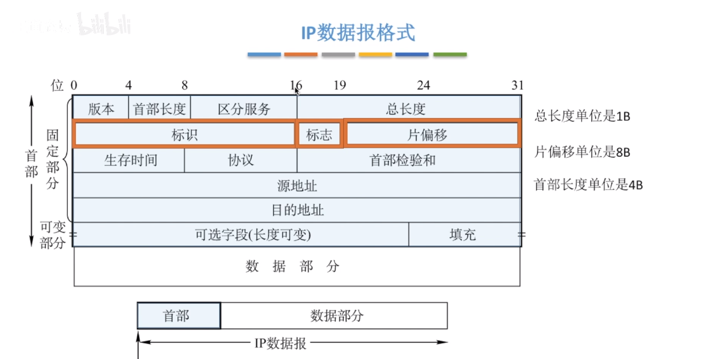
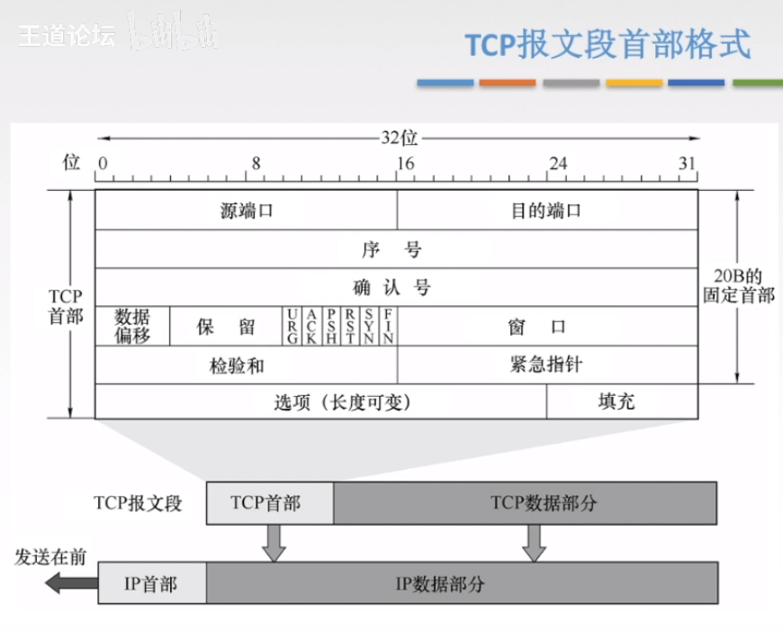
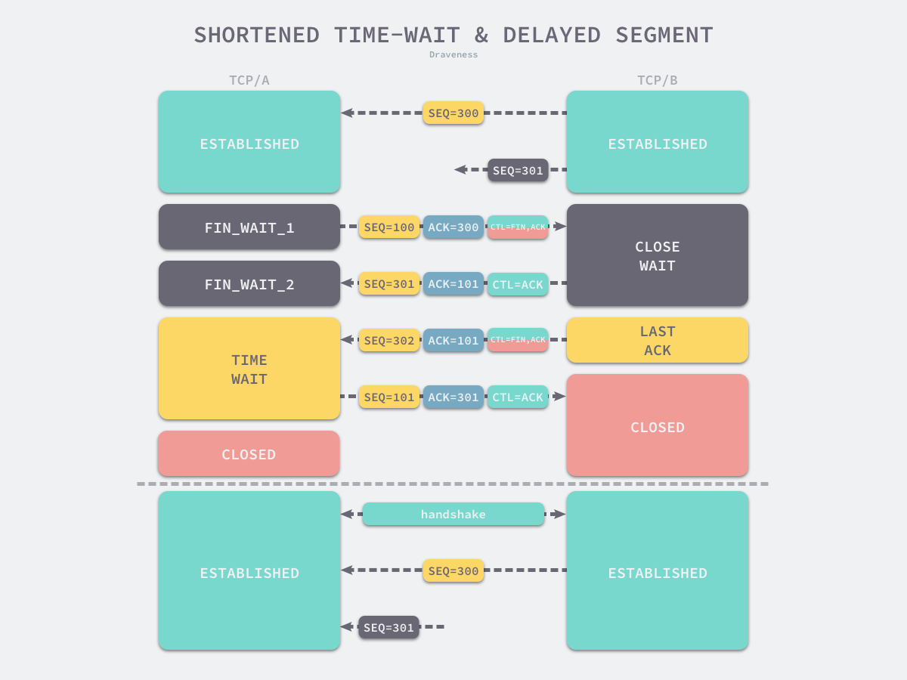

### TCP/IP一些核心知识
#### IP部分
##### IP报文格式

IP报文首部固定是20个字节

##### IP数据报几个重要的头部字段
###### 总长度（totlen）
在ip数据包头部中用一个总长度（totlen）字段表示数据包长度,即:首部和数据之和，单位为字节。总长度字段为 16 位，因此数据报的最大长度为 2^16-1=65535 字节。

###### 生存时间（TTL）
表示数据报在网络中的寿命，占 8 位。该字段由发出数据报的源主机设置。其目的是防止无法交付的数据报无限制地在网络中传输，从而消耗网络资源。
路由器在转发数据报之前，先把 TTL 值减 1。若 TTL 值减少到 0，则丢弃这个数据报，不再转发。因此，TTL 指明数据报在网络中最多可经过多少个路由器。TTL 的最大数值为 2^8 -1 = 255。若把 TTL 的初始值设为 1，则表示这个数据报只能在本局域网中传送。

###### 标识
占16位,分片时用来标识数据包所属分组,让计算机更加清晰知道哪些分片是同一个组的

###### 标志
告诉底层当前数据包是否分片 (do not fragment)

###### 片偏移
当前数据包相对于完整数据包的偏移量,单位是8字节

#### TCP 部分

##### TCP 报文格式

TCP首部固定为20个字节,其中源端口号和目的端口号各占两个字节,序号和确认号各占据四个字节

##### 为什么会有TIME_WAIT 

TIME_WAIT 是主动关闭连接的一方,在发送完最后一个ACK报文后进入的等待状态,在2MSL时间过去以后才会真正的关闭连接.

2MSL,MSL(max segment lifetime),帧最长生存时间,超过就会被丢弃,在linux中,可以通过`/proc/sys/net/ipv4/tcp_fin_timeout` 查看系统的配置的时间,默认是60秒.

为什么是2MLS? 简单的理解就是,考虑极端情况,给足报文在网络中的传输时间上限,那么一来一回需要两个MSL

TIME_WAIT存在的原因有以下几点:

1. 如果time_wait的时间过短或者没有,那么当主动关闭方发送最后一个ACK报文时,有可能会在网络中丢失,那么被关闭一方会因为超时重传机制,重新发送FIN报文. 这时关闭方已经处于关闭状态,无法识别这个FIN报文,然后发送RST报文给被关闭方,到时被关闭方的异常关闭
2. 防止迟到的数据对新建立的且使用相同源IP&端口号和目标IP&端口号的TCP连接造成干扰.在上面的图中,SEQ=301的报文在网络中徘徊了很久,最终错误的发给了新连接,那么就有可能因为序列号恰巧一致或不一致等原因对数据造成干扰

另外补充一点,就是当关闭方的ACK未正确到达被关闭方时,被关闭方会发起重传,关闭方收到后重发ACK报文,并重置TIME_WAIT计时器

